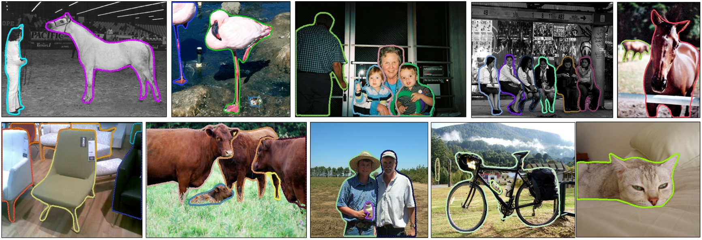
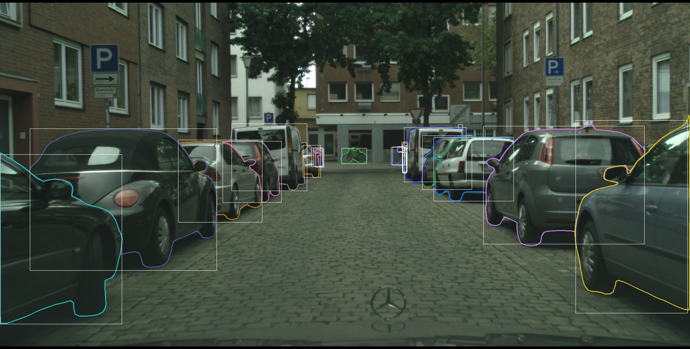
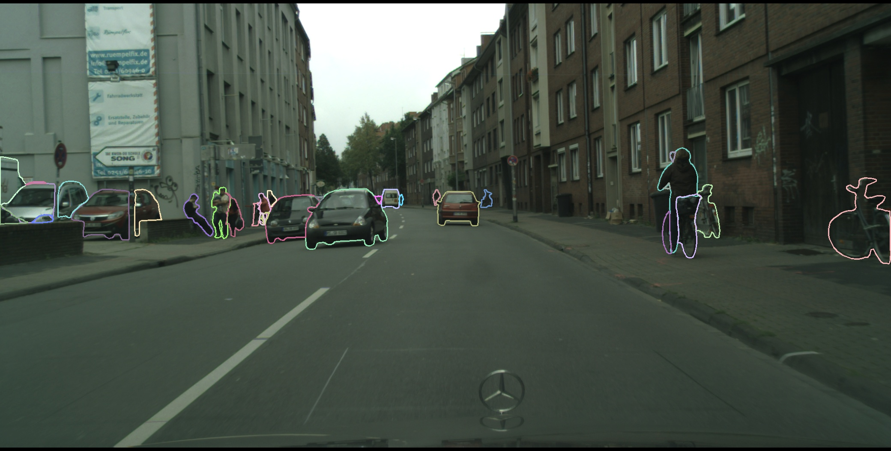
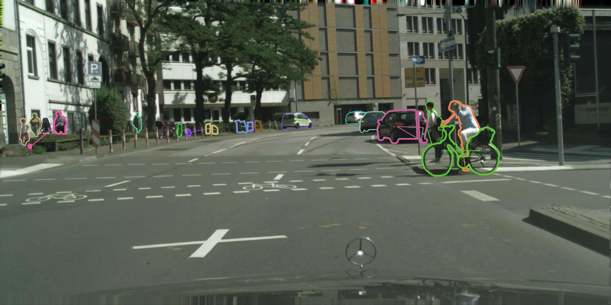

# TSnake: Time-Embed Recurrent Contour-Based Instance Segmentation


##  Installation
Please see [install.md](INSTALL.md)

## Performance

|Dataset|AP|Image size|
|--|--|--|
| SBD val | 60.5 | 512x512 |
| Cityscapes val | 33.7 | 1216x2432 |
| Cityscapes val, multi-compoent detection | 39.6 | 1216x2432 |
| Cityscapes val, CCNet | 38.8 | 1216x2432 |

## Testing
### Testing on SBD
download trained weight from [GDrive](https://drive.google.com/file/d/1kjl-bTI7bQsBjvB_XxJxFT4yiWsqKAF7/view?usp=drive_link)
```
python test.py sbd_time_embd --checkpoint /the/path/to/weight
```
### Testing on Cityscapes
download trained weight from [GDrive, multi-component detection](https://drive.google.com/file/d/185XzMG20Cp5K7ziNHlFbTnzHWar9wAC4/view?usp=drive_link)
download trained weight from [GDrive, single detection](https://drive.google.com/file/d/1BtQ4dhs8LPRP3vMBs5ZkX504U0QUtP-m/view?usp=drive_link)
```
# multi-component detection
## coco evaluator
python test.py cityscapesCoco_rcnn --checkpoint /the/path/to/weight
## cityscapes evaluator
python test.py cityscapesCoco_rcnn --checkpoint /the/path/to/weight --dataset cityscapes_val
```
demo

```
# single detector
## coco evaluator
python test.py cityscapesCoco --checkpoint /the/path/to/weight
## cityscapes evaluator
python test.py cityscapesCoco --checkpoint /the/path/to/weight --dataset cityscapes_val
```
demo

### Testing on Cityscapes, CCNet
download trained weight from [GDrive](https://drive.google.com/file/d/10QmUBFBiNKNy6B6G65KI27HJFIzzQjXk/view?usp=drive_link)
```
## coco evaluator
python test.py cityscapesCoco_e2ec_combine --checkpoint /the/path/to/weight
## cityscapes evaluator
python test.py cityscapesCoco_e2ec_combine --checkpoint /the/path/to/weight
```
image of CCNet

### Testing evaluation time
```
python test.py <corresponding name from above> --checkpoint /the/path/to/weight --type speed
```

## Training
### Training on SBD
prepare dataset first, installation is in [INSTALL.md](./INSTALL.md)
```
python train_net.py sbd_time_embd <--exp-name experiment_name> \
<--model_dir /path/save/model> [--checkpoint /path/to/pretrained/] \
[--wandb-id /name/of/wandb] [--bs 20] [--type finetune]
```
### Training on Cityscapes, multi-component detection
prepare dataset first, installation is in [INSTALL.md](./INSTALL.md)
```
python train_net.py cityscapesCoco <--exp-name experiment_name> \
<--model_dir /path/save/model> [--checkpoint /path/to/pretrained/] \
[--wandb-id /name/of/wandb] [--bs 8] [--type finetune]
```
If need load model only, add "--type finetune". Otherwise, the model, scheduler, optimizer and recorder will be loaded together.
### Training on Cityscapes, CCNet
prepare dataset first, installation is in [INSTALL.md](./INSTALL.md)
prepare segmentation model or pretrained weight
```
python train_net.py cityscapesCoco <--exp-name experiment_name> \
<--model_dir /path/save/model> <--checkpoint /path/to/pretrained/or/model --type finetune> \
[--wandb-id /name/of/wandb] [--bs 8] 
```
Ours uses [E2EC segmentation](https://github.com/zhang-tao-whu/e2ec).
## Acknoledgement
Code is largely based on [E2EC](https://github.com/zhang-tao-whu/e2ec) and [Polysnake](https://github.com/fh2019ustc/PolySnake)